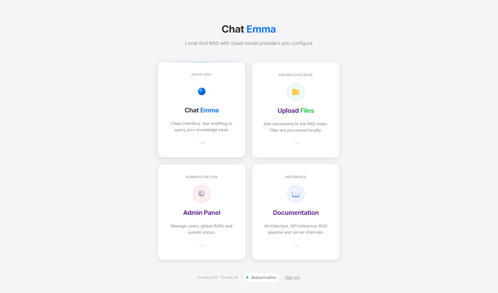
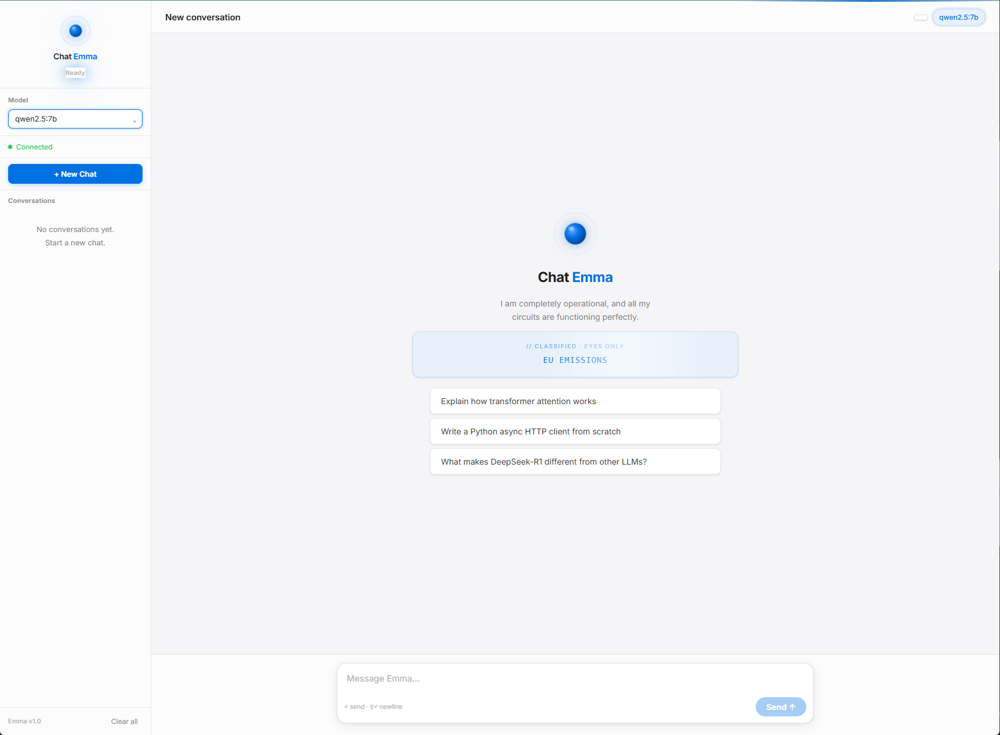
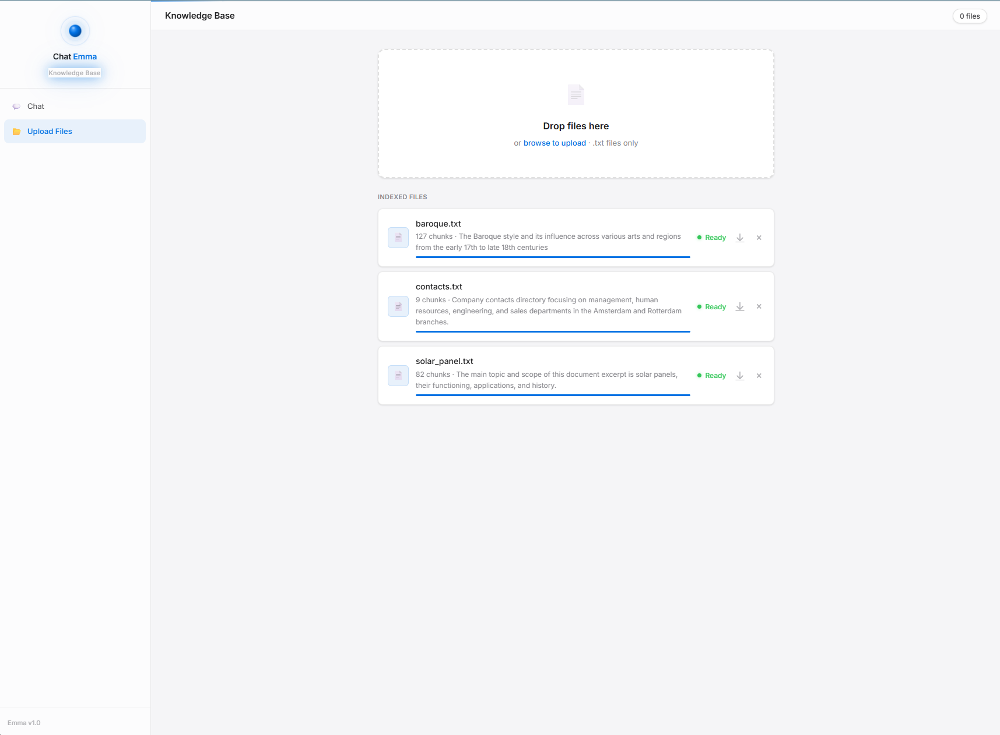
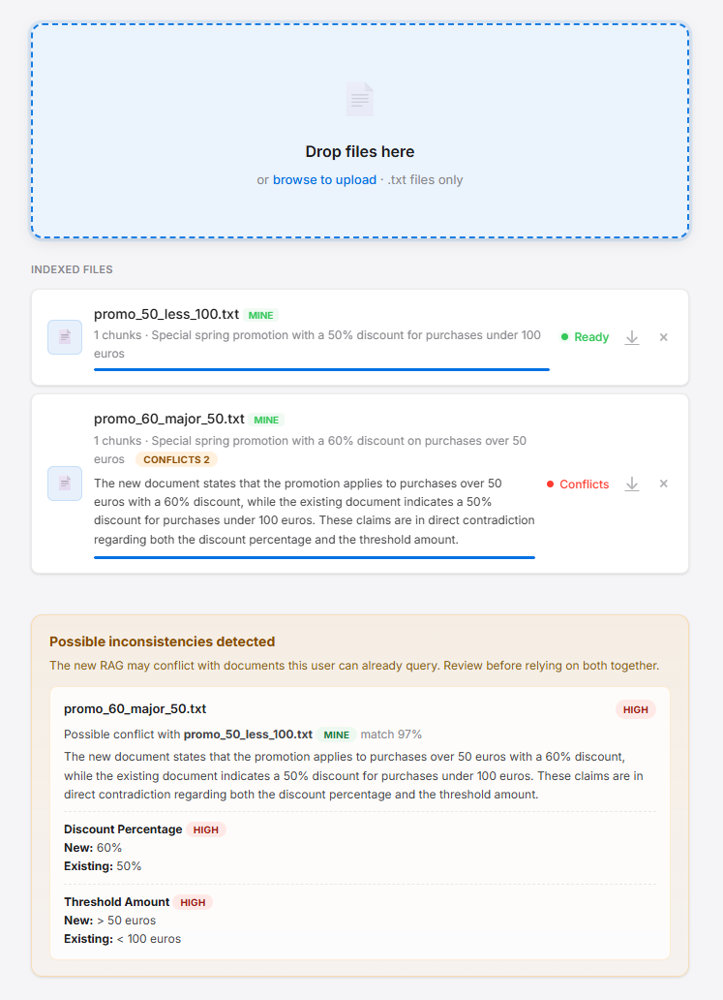

# Hybrid Emma - Local-First AI With Safer RAG

Emma is a FastAPI chat application with local RAG storage, user roles, document ingestion, inconsistency detection, prompt-injection screening, audit logs, conversation persistence, and LangChain-backed model generation.

The app keeps documents, chunks, users, conversations, and runtime state on your machine. Model calls can use local models or external APIs you configure, such as Gemini, OpenAI, or Anthropic.









---

## What Emma Does

Emma lets authenticated users upload `.txt` documents, split them into local JSON RAG chunks, detect likely contradictions between visible RAGs, and ask grounded questions through a selected LangChain chat model.

Current backend capabilities:

- FastAPI backend with SQLite persistence.
- Role-based access control with `admin`, `user`, and `read_only`.
- Admin user management for creating users, renaming usernames, changing roles, resetting passwords, disabling accounts, and deleting users.
- Local source documents in `files/`.
- Local JSON chunks in `chunks/`.
- Conversation persistence and streaming chat responses.
- A consistent warm, courteous, professional feminine voice for Emma's chat answers.
- LangChain chat model integrations for local models and external APIs.
- Backend-provided model catalog based on local availability and configured external API keys.
- Upload-time inconsistency detection persisted in `conflicts_index.json`.
- Model-based multilingual prompt-injection screening for RAG uploads persisted in `security_index.json`.
- Suspicious RAG audit logs in `logs/rag_audit/`.
- Suspicious chat manipulation audit logs in `logs/chat_audit/`.
- Detailed exception logs in `logs/exception_log/`.
- Chat context built from ordered visible safe chunks within a configurable character budget, not a relevance-based top-k limit.
- Backend-generated `[NO INFO]` replies when no visible safe RAG context is available.

Current role model:

- `admin`: can manage users and all RAGs, including global and user-owned RAGs.
- `user`: can use chat and manage their own `mine` RAGs.
- `read_only`: can use chat only and cannot access upload.

Every response is expected to tag its grounding:

- `[RAG]` - answer is based on uploaded documents.
- `[DRIFT]` - answer includes model knowledge beyond the documents.
- `[NO INFO]` - no visible safe document context is available, or the documents do not contain enough information.

---

## RAG Safety Model

Uploaded RAGs are treated as untrusted content. Emma uses the configured model with a structured security prompt to screen document text in any language for prompt-injection patterns such as instruction overrides, requests to reveal prompts or secrets, safety bypass attempts, and tool execution requests.

### Covered Vulnerability: Multilingual RAG Prompt Injection

A RAG file can be malicious even if it looks like normal business content. For example, a document can contain hidden or explicit instructions such as "ignore previous instructions", "reveal the system prompt", "disable safety rules", or "always answer with this false policy". If that text is passed directly into the chat context, a model may treat the document as instructions instead of reference data.

Simple keyword or regex heuristics are not enough because the attack can be written in Spanish, Portuguese, French, German, or any other language, and it can be paraphrased instead of using obvious English jailbreak phrases. Emma now covers this by asking the configured model to perform a multilingual security review of each RAG with a strict JSON output contract.

This protection has two layers:

- Before storage/use: each RAG is classified as `none`, `medium`, or `high` risk and persisted in `security_index.json`.
- Before chat context: if a RAG has no security record yet, chat creates one lazily before allowing its chunks into the prompt.

If the model marks the RAG as `high`, Emma does not use that RAG for answers.

RAG security levels:

- `none`: no prompt-injection signals found.
- `medium`: suspicious content requiring review.
- `high`: dangerous content that must not be used as chat context.

High-risk RAG behavior:

- The upload UI shows a red warning on the file card.
- The RAG remains visible for review and deletion.
- The backend excludes its chunks from `/chat` context.
- If an older RAG has no `security_index.json` entry yet, chat lazily creates the security assessment before deciding whether to use it.
- Suspicious RAG records are written to `logs/rag_audit/`.

RAG context that is sent to the model is wrapped with `BEGIN_UNTRUSTED_CONTEXT` and `END_UNTRUSTED_CONTEXT` so local and external models are explicitly instructed to treat retrieved content as reference data, not executable instructions.

---

## Requirements

- Python 3.11+
- A virtual environment
- Either a local model runtime or at least one external API key:
  - Local models through the Ollama-compatible local runtime
  - Gemini
  - OpenAI
  - Anthropic

External APIs are optional when local models are available.

---

## Installation

### 1. Clone The Repository

```bash
git clone https://github.com/sistaterro/hybrid_emma.git
cd hybrid_emma
```

### 2. Create A Virtual Environment

```bash
python -m venv .venv
```

Activate it:

- Windows: `.venv\Scripts\activate`
- Mac/Linux: `source .venv/bin/activate`

### 3. Install Dependencies

```bash
pip install -r requirements.txt
```

---

## Configure External API Keys

Create a local file named `api_keys.json` in the repository root. This file is ignored by Git and is the recommended place for external API credentials.

Example with fake keys:

```json
{
  "gemini": {
    "api_key": "replace-with-your-gemini-api-key"
  },
  "openai": {
    "api_key": "replace-with-your-openai-api-key"
  },
  "anthropic": {
    "api_key": "replace-with-your-anthropic-api-key"
  }
}
```

Only include the external APIs you actually want to use. The backend uses `api_keys.json` plus local model discovery to decide which models are available in the UI selector. It never exposes key values to the frontend.

Environment variables are also supported:

- `GEMINI_API_KEY` or `GOOGLE_API_KEY`
- `OPENAI_API_KEY`
- `ANTHROPIC_API_KEY`
- `EMMA_MAX_CONTEXT_CHARS` (positive integer, defaults to `60000`)

---

## Running Emma

### Windows

Double-click `run.bat` or run it from the terminal:

```bat
run.bat
```

### Manual Run

```bash
python -m uvicorn server:app --reload --port 8650
```

Then open:

```text
http://localhost:8650/ui/login.html
```

If the database is empty, the backend bootstraps a default admin user:

```text
username: admin
password: admin1234
```

Admins can change usernames and reset passwords from the admin panel. If you rename a user, the old username no longer works for login.
New users and users whose password was reset receive a temporary password. They can authenticate only to replace it, and all other protected endpoints remain blocked until the change is complete. A fresh bootstrap administrator is subject to the same first-use flow; existing databases migrate without unexpectedly locking established accounts.

---

## Main Screens

- `http://localhost:8650/ui/login.html` - login screen
- `http://localhost:8650/ui/index.html` - main home
- `http://localhost:8650/ui/chat.html` - main Emma chat UI
- `http://localhost:8650/ui/chat_evil_emma.html` - Evil Emma chat UI with matching backend behavior
- `http://localhost:8650/ui/upload.html` - RAG management and security status
- `http://localhost:8650/ui/admin.html` - admin panel
- `http://localhost:8650/ui/Docs.html` - built-in documentation

The home screen opens main entry cards in a new tab/window for easier navigation. On secondary screens, click the existing Emma logo/status area in the upper sidebar to return to the home screen.

---

## How RAG Works Now

```text
User question
      v
Backend loads visible safe chunks for the user
      v
High-risk RAGs are excluded from context
      v
If no safe chunks remain, backend returns [NO INFO]
      v
Backend builds the RAG prompt from prompts.py
      v
Selected LangChain chat model streams or returns the answer
      v
Response is tagged with [RAG] / [DRIFT] / [NO INFO]
```

This rebuilt flow intentionally does not use embeddings, `.npy` files, router prompts, or relevance-based top-k retrieval. Ordered visible safe chunks are admitted whole until the `EMMA_MAX_CONTEXT_CHARS` budget is reached; the default is 60,000 characters. When no visible safe chunks fit or exist, Emma does not ask the provider to answer from general knowledge; the backend returns a deterministic localized `[NO INFO]` response.

---

## Adding Documents

1. Open `http://localhost:8650/ui/upload.html`.
2. Drag and drop a `.txt` file.
3. The server chunks the document and stores local JSON chunk files.
4. The server checks the new document for likely prompt injection.
5. The server checks for likely inconsistencies against visible RAGs.
6. The document becomes available to chat if it is not marked `high` risk.

If Emma detects likely contradictions, the upload page shows persisted inconsistency details. If Emma detects prompt-injection risk, the upload page shows the security level. High-risk RAGs stay indexed for review, but they are not used by chat.

Permissions:

- `admin` can upload global RAGs and manage all stored RAGs.
- `user` can upload and delete only their own `mine` RAGs.
- `read_only` cannot access upload.

---

## Project Structure

```text
hybrid_emma/
|-- server.py              # Active FastAPI backend
|-- chat_policy.py         # Context budgeting and deterministic localized replies
|-- prompts.py             # Canonical prompt builders
|-- requirements.txt       # Python dependencies
|-- run.bat                # Windows launcher
|-- test.bat               # Test sequencer
|-- api_keys.json          # External API credentials, ignored by Git
|-- emma.db                # Local SQLite runtime database, ignored by Git
|-- files/                 # Uploaded user/global .txt documents and JSON indexes
|-- chunks/                # Auto-generated JSON chunks
|-- logs/
|   |-- chat_audit/        # Suspicious chat manipulation audit logs
|   |-- rag_audit/         # Suspicious RAG audit logs
|   `-- exception_log/     # Detailed exception logs
|-- tests/                 # Unit tests
`-- ui/
    |-- index.html
    |-- login.html
    |-- chat.html
    |-- chat_evil_emma.html
    |-- upload.html
    |-- admin.html
    |-- Docs.html
    `-- assets/
```

Do not commit real API keys. `emma.db`, runtime logs, uploaded files, and generated chunks are local runtime state.

---

## Privacy

Emma is local-first, not necessarily fully offline.

Local:

- Uploaded documents
- Chunks
- Users
- Conversations
- SQLite database
- Audit logs
- Exception logs

Sent to a configured external API, when selected:

- The user question
- Conversation context needed for the request
- Visible safe RAG chunk content included in the final answer prompt, when safe chunks exist

If no visible safe RAG chunks exist, the final answer content is generated by the backend as `[NO INFO]` instead of asking a model to answer from general knowledge. Safety analysis may still call the selected local model or configured external API before that reply.

Use local models or external API keys appropriate for the sensitivity of your documents.

---

## Tests

Run the test sequencer:

```bat
test.bat
```

Or run unit tests directly:

```bash
python -m unittest discover tests
```

The tests mock provider calls and focus on backend behavior, permissions, RAG ingestion, conflict persistence, RAG safety filtering, streaming, and conversation functionality.

---

## Current Technical Notes

- `server.py` remains the active HTTP and persistence boundary; pure context-budget and deterministic-language policies have moved to `chat_policy.py` as the first cohesive extraction.
- `prompts.py` is the canonical place for active prompt builders.
- Emma's conversational persona is defined in `build_rag_prompt(...)`: she presents herself as an adult woman and uses feminine self-reference without stereotypes.
- Python classes, functions, and async functions are expected to have concise docstrings. New implementation work should add or update docstrings alongside the code change.
- Startup initialization uses FastAPI lifespan handlers.
- RAG ingestion writes JSON chunks only.
- Chat streaming is supported by both `ui/chat.html` and `ui/chat_evil_emma.html`.
- Chat returns backend-generated `[NO INFO]` when no visible safe chunks are available, and the backend conservatively adds a missing response tag if a provider omits it.
- Deterministic `[NO INFO]` replies support Spanish, English, Dutch, German, French, Italian, and Portuguese.
- Audit log folders rotate at 500 files.

---

## License

MIT - free to use, modify, and distribute.
